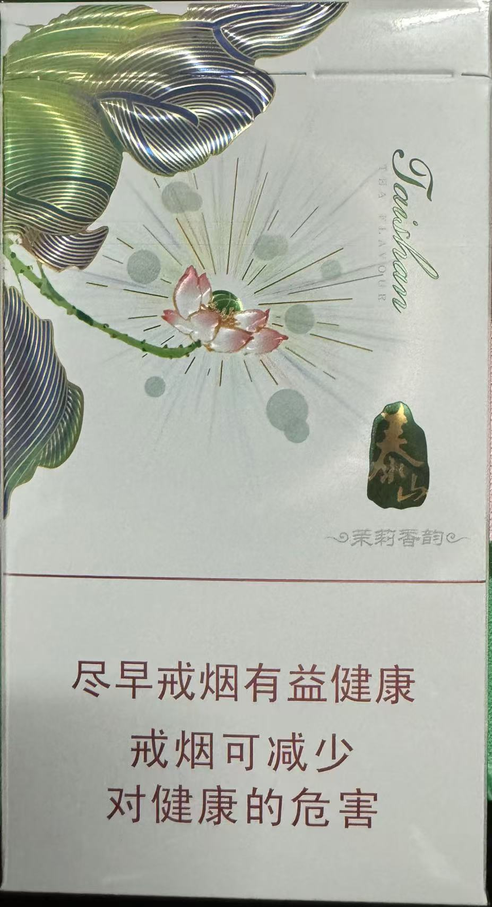
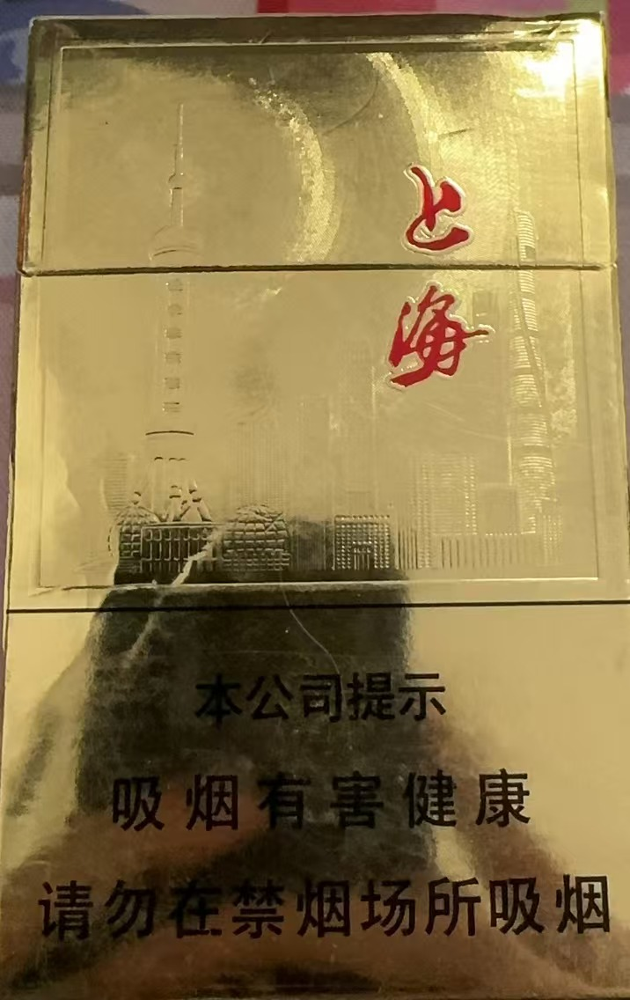
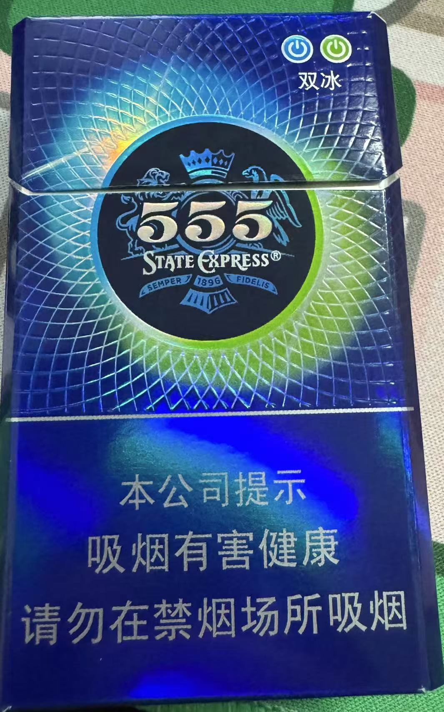
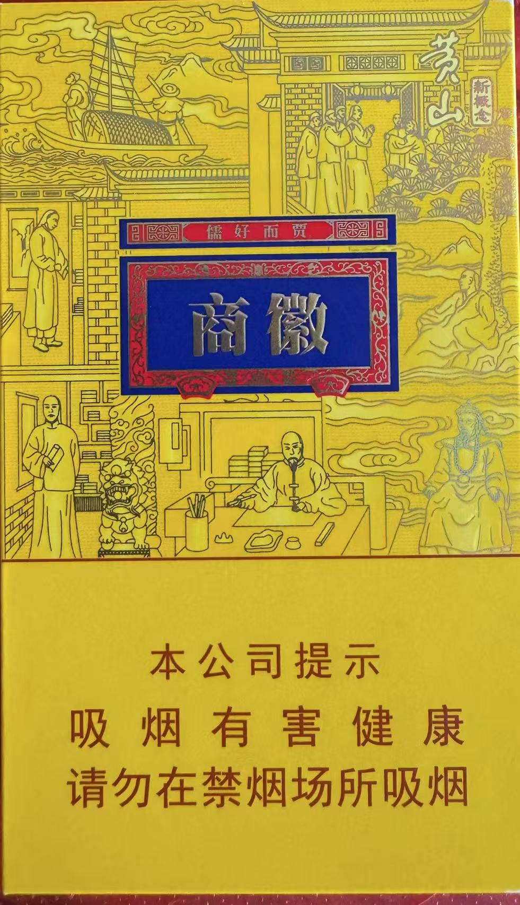
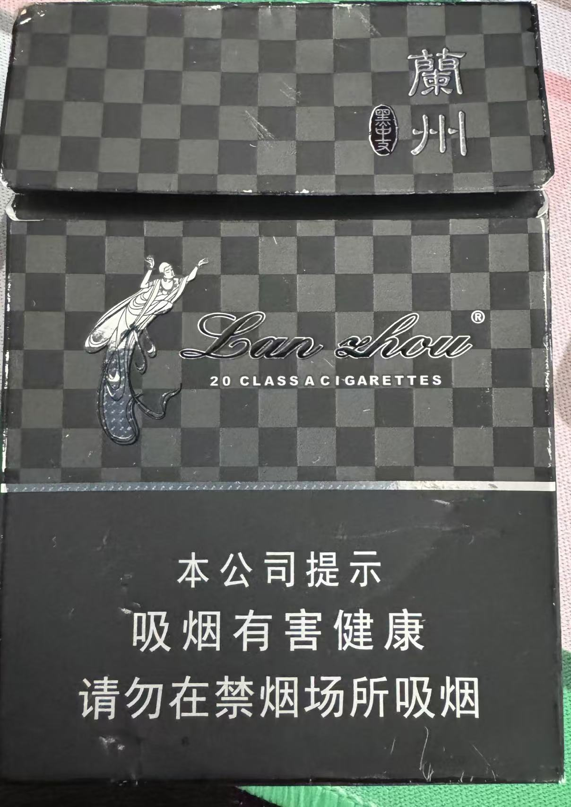
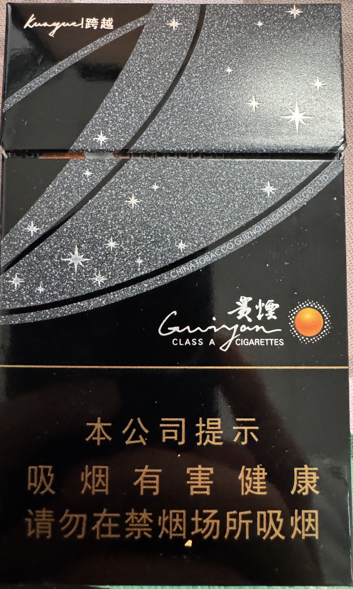

<span style="color: red;">尽早戒烟有益健康
戒烟可减少
对健康的危害</span>

# SmokeScience

烟草里的科学

# PR FLOW

1. 在Images文件夹下上传烟类型的照片，命名规范，泰山-xx.jpg etc.
2. 在README中引用，并且附属购买地点，价格，数量等信息
3. example
    - 信息

    ```html
    <table border="1">
        <tr>
            <th>价格</th>
            <th>购买地点</th>
            <th>类别</th>
            <th>爆珠口味</th>
            <th>长度</th>
            <th>焦油量</th>
            <th>烟气烟碱量</th>
            <th>烟气一氧化碳量</th>
            <th>推荐等级</th>
        </tr>
        <tr>
            <td>20</td>
            <td>&lt;地点&gt;</td>
            <td>粗/细</td>
            <td>&lt;薄荷&gt;</td>
            <td>★★★★☆</td>
        </tr>
    </table>

    ```

    - 照片

    ```html

    <div align="center">
        
    </div>
    ```

4. 提交PR即可

# 类别

## 山东

1. 泰山-将军

- 信息

<table border="1">
  <tr>
    <th>价格</th>
    <th>购买地点</th>
    <th>类别</th>
    <th>爆珠口味</th>
    <th>长度</th>
    <th>焦油量</th>
    <th>烟气烟碱量</th>
    <th>烟气一氧化碳量</th>
    <th>推荐等级</th>
  </tr>
  <tr>
    <td>20</td>
    <td>山东</td>
    <td>细</td>
    <td>无爆珠</td>
    <td>97mm</td>
    <td>8mg</td>
    <td>0.8mg</td>
    <td>6mg</td>
    <td>★★☆☆☆</td>
  </tr>
</table>

- 照片

<div align="center">
    
</div>

2. 泰山-颜悦

- 信息

<table border="1">
  <tr>
    <th>价格</th>
    <th>购买地点</th>
    <th>类别</th>
    <th>爆珠口味</th>
    <th>长度</th>
    <th>焦油量</th>
    <th>烟气烟碱量</th>
    <th>烟气一氧化碳量</th>
    <th>推荐等级</th>
  </tr>
  <tr>
    <td>20</td>
    <td>山东</td>
    <td>细</td>
    <td>无爆珠</td>
    <td>97mm</td>
    <td>8mg</td>
    <td>0.8mg</td>
    <td>6mg</td>
    <td>★★★☆☆</td>
  </tr>
</table>
- 照片

<div align="center">
    
</div>

3. 泰山-茉莉香韵

- 信息

<table border="1">
  <tr>
    <th>价格</th>
    <th>购买地点</th>
    <th>类别</th>
    <th>爆珠口味</th>
    <th>长度</th>
    <th>焦油量</th>
    <th>烟气烟碱量</th>
    <th>烟气一氧化碳量</th>
    <th>推荐等级</th>
  </tr>
  <tr>
    <td>60</td>
    <td>山东</td>
    <td>细</td>
    <td>茉莉花</td>
    <td>97mm</td>
    <td>6mg</td>
    <td>0.6mg</td>
    <td>5mg</td>
    <td>★★★★★</td>
  </tr>
</table>
- 照片

<div align="center">
    
</div>

## 上海

1. 上海

- 信息

<table border="1">
  <tr>
    <th>价格</th>
    <th>购买地点</th>
    <th>类别</th>
    <th>爆珠口味</th>
    <th>长度</th>
    <th>焦油量</th>
    <th>烟气烟碱量</th>
    <th>烟气一氧化碳量</th>
    <th>推荐等级</th>

  </tr>
  <tr>
    <td>15</td>
    <td>上海</td>
    <td>粗</td>
    <td>无爆珠</td>
    <td>unknown</td>
    <td>11mg</td>
    <td>1.0mg</td>
    <td>12mg</td>
    <td>★★★☆☆</td>
  </tr>
</table>

- 照片

<div align="center">
    
</div>

## 印尼

1. 555-双冰

- 信息

<table border="1">
  <tr>
    <th>价格</th>
    <th>购买地点</th>
    <th>类别</th>
    <th>爆珠口味</th>
    <th>长度</th>
    <th>焦油量</th>
    <th>烟气烟碱量</th>
    <th>烟气一氧化碳量</th>
    <th>推荐等级</th>

  </tr>
  <tr>
    <td>30</td>
    <td>武汉</td>
    <td>粗</td>
    <td>双冰，薄荷口味</td>
    <td>unknown</td>
    <td>9mg</td>
    <td>0.6mg</td>
    <td>8mg</td>
    <td>★★★★★</td>
  </tr>
</table>

- 照片

<div align="center">
    
</div>

## 安徽

1. 徽商

- 信息

<table border="1">
  <tr>
    <th>价格</th>
    <th>购买地点</th>
    <th>类别</th>
    <th>爆珠口味</th>
    <th>长度</th>
    <th>焦油量</th>
    <th>烟气烟碱量</th>
    <th>烟气一氧化碳量</th>
    <th>推荐等级</th>

  </tr>
  <tr>
    <td>50</td>
    <td>安徽</td>
    <td>细</td>
    <td>石斛爆珠</td>
    <td>unknown</td>
    <td>8mg</td>
    <td>0.7mg</td>
    <td>6mg</td>
    <td>★★★★☆</td>
  </tr>
</table>

- 照片

<div align="center">
    
</div>

## 甘肃

1. 兰州

- 信息

<table border="1">
  <tr>
    <th>价格</th>
    <th>购买地点</th>
    <th>类别</th>
    <th>爆珠口味</th>
    <th>长度</th>
    <th>焦油量</th>
    <th>烟气烟碱量</th>
    <th>烟气一氧化碳量</th>
    <th>推荐等级</th>

  </tr>
  <tr>
    <td>30</td>
    <td>兰州</td>
    <td>中</td>
    <td>无</td>
    <td>unknown</td>
    <td>8mg</td>
    <td>0.8mg</td>
    <td>8mg</td>
    <td>★★★★☆</td>
  </tr>
</table>

- 照片

<div align="center">
    
</div>


## 贵州

1. 跨越

- 信息

<table border="1">
  <tr>
    <th>价格</th>
    <th>购买地点</th>
    <th>类别</th>
    <th>爆珠口味</th>
    <th>长度</th>
    <th>焦油量</th>
    <th>烟气烟碱量</th>
    <th>烟气一氧化碳量</th>
    <th>推荐等级</th>

  </tr>
  <tr>
    <td>24</td>
    <td>武汉</td>
    <td>中</td>
    <td>陈皮</td>
    <td>unknown</td>
    <td>5mg</td>
    <td>0.7mg</td>
    <td>7mg</td>
    <td>★★★★☆</td>
  </tr>
</table>

- 照片

<div align="center">
    
</div>
